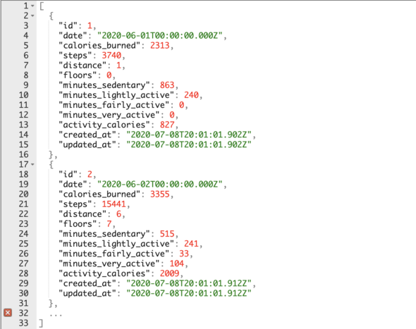

# Health Insights API Readme

Health Insights API is a back-end application that serves Fitbit-tracked health data as JSON. 



## Technology Used

---

This project uses

* Ruby v2.4.0
* Rails 5.2.4.3


## Get Started
---

###  Clone the repo

```
$ git clone
$ cd health-patterns-api
```

### Check your Ruby version

```
$ ruby -v
```

If your version is earlier than the Ruby version above, you may need to update it. You can use [Ruby Version Manager (RVM)](https://rvm.io/) to install and select the proper Ruby environment.

### Install Dependencies

Perform a bundle install:

```
$ bundle
```

### Initialize the database

```
$ rake db:create db:migrate import:fitbit_data
```

### Verify successful import

```
$ rails console
> Activity.count
```

If you get back any number greater than 0, the import was successful. Type `exit` to get out of the console.

### Start the dev server

```
$ rails s
```